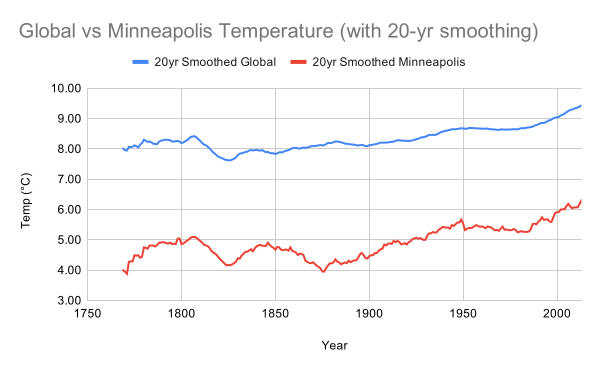
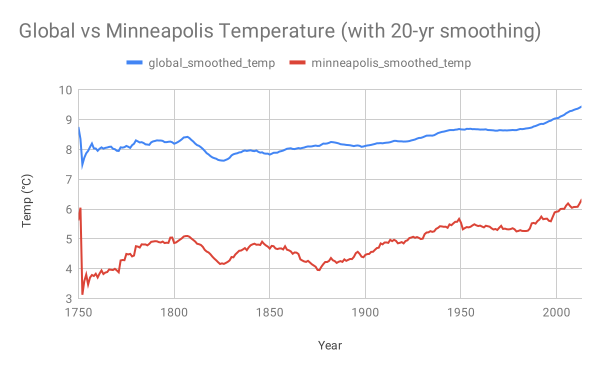

## Introduction
In this project, I analyzed local and global temperature data over roughly two and a half centuries for the purpose of comparison.  Local data was for Minneapolis, Minnesota, USA.

The goal of the project was (1) to create a visualization that compares local versus global temperature trends and (2) to make observations regarding similarities, differences, and overall trends.

## Data
The data for this project was supplied by Udacity, but required using SQL in order to obtain both the global as well as the local data for use in constructing the visualizations.

## Overall Methodology
The desired visualization required the use of a moving average in order to smooth out the "jaggedness" in the plotted curves so that overall trends would be more easily discernible.  So, three distinct tasks were necessary for producing the visualization:

1. Obtaining the raw temperature data,
2. Smoothing (i.e., creating a moving average), and,
3. Plotting.

Creating a moving average was tried with averaging windows of various sizes -- 3 years, 5 years, 10 years, and 20 years.  It was decided to make all plots with a 20-year smoothing window, since this reduced the "jaggedness" to an acceptable amount for the purpose of focusing on long-term trends.

## Additional Challenge
For this project, I set for myself the challenge of obtaining the desired visualization in a variety of ways using the tools I was most comfortable with at the time -- namely, SQL, Google Sheets, and R.  Obtaining the raw temperature data requried using SQL.  However, smoothing (i.e., creating a moving average) can be done using a spreadsheet program such as Google Sheets or by creating a smoothing function in R or by using a window function in SQL.  Likewise, plotting can be done in Google Sheets or in R.  The aim of this self-imposed challenge was to figure out how to do the same tasks in different ways with the three tools (SQL, Google Sheets, and R).

| | Raw Data | Smoothing | Plotting |
|--|---------|-----------|----------|
| 1 | SQL | Google Sheets | Google Sheets |
| 2 | SQL | Google Sheets | R |
| 3 | SQL | R | R |
| 4 | SQL | SQL | R |
| 5 | SQL | SQL | Google Sheets |

This table summarizes the five methods utilized in what follows.

## Getting Started

The initial SQL query for obtaining the raw global and local (Minneapolis) data from the Udacity website was implemented with the following code.  The inner join (by default JOIN) excludes some years in which data was available globally, but not locally, say, or vice versa.  Joint data was obtained for the years 1750 to 2013, a total of 264 years.

```
SELECT gl.year,
	     gl.avg_temp global_av_temp,
       ci.avg_temp minneapolis_av_temp
    
FROM global_data AS gl
JOIN city_data AS ci
ON gl.year = ci.year
WHERE ci.city = 'Minneapolis'
```
The data obtained was then downloaded as a CSV file which could be uploaded to Google sheets or accessed by R.


## Method 1 -- SQL Raw Data, Smoothed and Plotted with Google Sheets

Here is the desired plot in which 20-year smoothing was implemented in Google Sheets by creating an additional column in which a function in each cell would average over the corresponding temperature for that year and the 19 preceding years -- for example, in cell `C21`, the function `=AVERAGE(B2:B21)`.  Then a plot of the smoothed data was created within Google Sheets.

```{r, out.width = "680px"}

```

Note that the first 19 data points from 1750 to 1768 are not plotted since for those years there are not enough previous data points to implement 20-year smoothing.

## Method 2 -- SQL Raw Data, Smoothed with Google Sheets, and Plotted with R

The raw SQL data was smoothed with Google Sheets as described previously and then downloaded to a CSV file to be used in R.  R was used to plot the data with the following code below.


```{r}
library(ggplot2)

df2 <- read.csv("proj1_20yr_Google_smoothed_data.csv")

gg_p2 <- ggplot(data=df2)

gg_p2 + geom_line(aes(x=Year,
                  y=X20yr.Smoothed.Global, color="Global")) +
  geom_line(aes(x=Year,
                y=X20yr.Smoothed.Minneapolis, color="Minneapolis")) +
  ylim(3,10) +
  xlab("Year") + 
  ylab("Temp (deg. C)") + 
  ggtitle("Global vs Minneapolis Average Temperatures (with 20-yr smoothing)") + 
  theme(legend.title = element_text(size=0),
        legend.position = "top")

```

The warning about 19 missing values concerns the years 1750 to 1768 as discussed previously.


## Method 3 -- SQL Raw Data, Smoothed and Plotted with R

A smoothing function was written in R and applied to the raw SQL data.  Then the smoothed data was plotted with R.  The advantage of this approach is that the size of the smoothing window can be changed quickly, by changing the value of the variable `smoothing`, and the resultant plot viewed immediately.

```{r}
library(data.table)

# Create smoothing function using the shift function from the data.table library
smoother <- function(data_col, N_ave){
  a <- data_col
  N <- N_ave
  b <- rep(0,length(a))
  
  # Create a list of N vectors with elements progressively shifted by one
  b_list <- shift(a, n=c(0:(N-1)), fill=0, type="lag")
  
  # Sum elements in the same position in the N vectors to create a vector, b, 
  # whose elements are N-element sums at each position in the vector
  for(i in 1:N){
    b <- b + unlist(b_list[i])
  }
  
  # Divide elements in vector b by N to create the average at each position
  d <- b / N
  
  # Replace the first N-1 elements with NAs since N-element smoothing could not 
  # occur uniformly over those elements
  e <- c(rep(NA, N-1), d[N:length(a)])

  return(e)
}

# Set the number of years to smooth/average over
smoothing <- 20

d <- read.csv("proj1_weather_trends_data.csv")

d$smoothed_global_av_temp <- smoother(d$global_av_temp, smoothing)
d$smoothed_minneapolis_av_temp <- smoother(d$minneapolis_av_temp, smoothing)

gg_c <- ggplot(data=d)

gg_c + geom_line(aes(x=year,
                     y=smoothed_global_av_temp, color="Global")) +
  geom_line(aes(x=year,
                y=smoothed_minneapolis_av_temp, color="Minneapolis")) +
  ylim(3,10) +
  xlab("Year") + 
  ylab("Temp (deg. C)") + 
  ggtitle("Global vs Minneapolis Average Temperatures (with 20-yr smoothing)") + 
  theme(legend.title = element_text(size=0),
        legend.position = "top")
```

Again, the data from 1750 to 1768 is missing since it is excluded by the smoothing algorithm coded above.

## Method 4 -- SQL Smoothed Data using a Window Function, Plotted with R

Smoothing (i.e., creating a moving average) was implemented in SQL alongside obtaining the raw data.  This was done using SQL window functions.  In this case the downloaded data was plotted with R.

```
SELECT gl.year,
	     gl.avg_temp global_av_temp,
       ci.avg_temp minneapolis_av_temp,
       AVG(gl.avg_temp) OVER (ORDER BY gl.year rows
            between 19 preceding and current row)
            AS global_smoothed_temp,
       AVG(ci.avg_temp) OVER (ORDER BY gl.year rows
            between 19 preceding and current row)
            AS minneapolis_smoothed_temp
    
FROM global_data AS gl
JOIN city_data AS ci
ON gl.year = ci.year
WHERE ci.city = 'Minneapolis'

```

```{r}
df4 <- read.csv("proj1_weather_trends_SQL_smoothed_data.csv")

gg_p4 <- ggplot(data=df4)

gg_p4 + geom_line(aes(x=year,
                     y=global_smoothed_temp, color="Global")) +
  geom_line(aes(x=year,
                y=minneapolis_smoothed_temp, color="Minneapolis")) +
  ylim(3,10) +
  xlab("Year") + 
  ylab("Temp (deg. C)") + 
  ggtitle("Global vs Minneapolis Average Temperatures (with 20-yr smoothing)") + 
  theme(legend.title = element_text(size=0),
        legend.position = "top")


```

The SQL window function averages over the specified preceding window.  When there is not enough previous data to comply with that window, it produces an average with what is present.  However, it still results in data.  So, these plots contain points for 1750 to 1768, although the smoothing in these cases cannot be over a 20-year window like the rest of the data.

## Method 5 -- SQL Smoothed Data using a Window Function, Plotted with Google Sheets

Finally, the downloaded data, smoothed using SQL, was uploaded to Google Sheets and plotted using Google Sheets.

```{r, out.width = "680px"}

```


## Observations

1. We see that there is roughly a 3 degree (Celcius) difference, on average, between the global average yearly temperature and the local, Minneapolis, average yearly temperature.  Minneapolis is roughly 3 degrees cooler than the global temperature, on average.

2. The smoothed curves track each other in form to a great deal which reinforces the conclusion that both of them are indicative of long-term trends.  For example, both have a slight peak about 1800 and then a trough around 1825.  There is an upward trajectory from about 1900 onward.  These long-term similarities between the curves suggest a kind of robustness to the findings.  Robustness in science occurs when multiple distinct sources converge on the same (or a similar) answer.

3. The averaged global temperature hovers around 8 degrees Celcius until the early twentieth century.  The Minneapolis averaged temperature experiences more variation over the same period but stays roughly between 4 and 5 degrees.

4. There is an upward trajectory to the temperature, both globally and locally, starting in the early twentieth century.

5. The current upward trend (roughly 1900 onward) has resulted in an increase in averaged temperature of 1 - 1.5 degrees more than what had been seen throughout the century before.

The latter observations suggest the phenomenon known as "climate change" and "global warming".  Of course, more and varied kinds of data would be necessary to conclusively justify that conclusion.